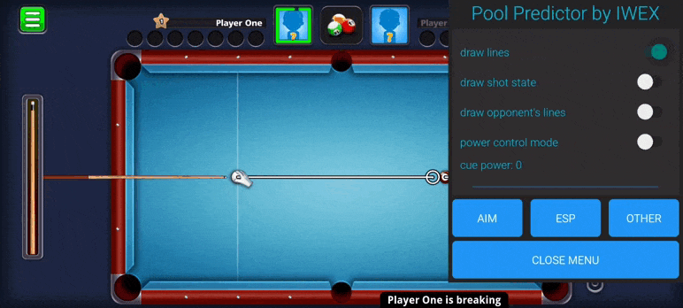

# Balls movement prediction mod for 8 Ball Pool v5.8.0



This mod only works with 8 Ball Pool version 5.8.0 armeabi-v7a (32-bit). You can't use it in online matches. Use it to improve your skills in both playing pool and modding android games :-)

# Prerequisites
- [Android Studio](https://developer.android.com/studio)
- [Apktool](https://apktool.org), [Apktool M (Android)](https://maximoff.su/apktool/?lang=en) or any other tool to decompile and recompile apk files

# How to use
1. Clone this repository.
2. Build release apk (In Android Studio press Build -> Generate Signed Bundle / APK).
3. Decompile the received apk file (hereafter *predictor*). 
4. Download 8 Ball Pool 5.8.0 armeabi-v7a apk file [here](https://www.apkmirror.com/apk/miniclip-com/8-ball-pool/8-ball-pool-5-8-0-release/8-ball-pool-5-8-0-2-android-apk-download/download).
5. Decompile 8 Ball Pool apk (hereafter *pool*).
6. Copy **LiveData.smali** and **MutableLiveData.smali** files from *predictor\\smali\\androidx\\lifecycle* to *pool\\smali\\androidx\\lifecycle*.
7. Open *predictor* and rename **smali** folder to **smali_classes5**, copy this folder to *pool*
8. Copy **libpoolpredictor.so** file from *predictor\\lib\\armeabi-v7a* to *pool\\lib\\armeabi-v7a*.
9. Open **predictor\\smali\\com\\iwex\\poolpredictor\\presentation\\activity\\MainActivity.smali** file and find **onCreate** method. Find the Pool Predictor launching code and copy it. It should look like this:
```
    sget-object v0, Lcom/iwex/poolpredictor/presentation/activity/LauncherActivity;->Companion:Lcom/iwex/poolpredictor/presentation/activity/LauncherActivity$Companion;

    move-object v1, p0

    check-cast v1, Landroid/content/Context;

    invoke-virtual {v0, v1}, Lcom/iwex/poolpredictor/presentation/activity/LauncherActivity$Companion;->launch(Landroid/content/Context;)V
```
10. Open **pool\\smali_classes3\\com\\miniclip\eightballpool\\EightBallPoolActivity.smali** file and find **onCreate** method. Paste the copied code at the end of **onCreate** method (before the **return-void** instruction).
11. Open **pool\\AndroidManifest.xml** file and add overlay permissions:
```
    <uses-permission android:name="android.permission.ACTION_MANAGE_OVERLAY_PERMISSION"/>
    <uses-permission android:name="android.permission.SYSTEM_ALERT_WINDOW"/>
```
12. Add PoolPredictor's Service and Activity definitions at the end of **application** tag (before the **&lt;/application&gt;**) in AndroidManifest.xml:
```
        <service
            android:name="com.iwex.poolpredictor.presentation.service.PredictorService"
            android:enabled="true"
            android:exported="false" />
        <activity
            android:name="com.iwex.poolpredictor.presentation.activity.LauncherActivity" />
```
13. Recompile pool apk, install it and enjoy.

# Disclaimer
This project is intended for educational purposes only. The author is not responsible for any misuse or damage caused by the software. Use it at your own risk.
